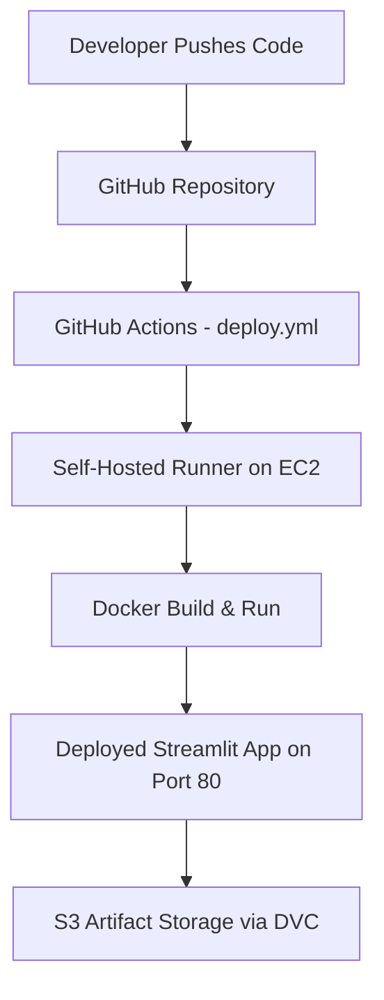

---

# AI-Powered Trading/Investment Assistant 📈

A comprehensive FinTech web application that leverages **Machine Learning**, **Modern Portfolio Theory**, and **MLOps automation** to deliver intelligent, real-time stock market insights and investment recommendations.

---

## 🎓 Team Members

* **Prem Pratap** (22070126078)
* **Punit Chetwani** (22070126079)
* **Ayush Anand** (22070126025)
* **Paarth Chauhan** (22070126069)

---

## 🌟 Features

### 1. Interactive Dashboard

* Real-time stock data visualization
* Company info and key financial metrics
* Historical candlestick charts
* Performance tracking and comparison

### 2. ML-Powered Price Prediction

* **LSTM** and **Prophet** for forecasting
* **Ensemble models** for improved accuracy
* Configurable forecast periods (7–90 days)

### 3. Portfolio Optimization

* **Modern Portfolio Theory (MPT)** implementation
* Efficient frontier visualization
* Strategies: Max Sharpe, Min Volatility, Risk Parity, Equal Weight

### 4. Risk & Performance Analysis

* VaR, CVaR, Sharpe, Sortino, Calmar ratios
* Rolling volatility and drawdown tracking
* Beta/Alpha metrics and comparative risk profiling

### 5. Technical Analysis

* RSI, MACD, Bollinger Bands, Stochastic Oscillator
* Automated signal generation and backtesting

---

## 🧠 MLOps Architecture

This project is designed and deployed using modern **MLOps principles** — automating every step from data collection to deployment.

| Stage                              | Description                                                                                            |
| ---------------------------------- | ------------------------------------------------------------------------------------------------------ |
| **1. Data Pipeline**               | Fetches live market data from RapidAPI/Yahoo Finance → cleans and preprocesses in-app for model input. |
| **2. Model Training**              | Uses Prophet and LSTM models for stock trend forecasting.                                              |
| **3. Version Control**             | Code tracked with **Git**, datasets and models versioned using **DVC** for full reproducibility.       |
| **4. Artifact Storage**            | Trained model artifacts stored in **Amazon S3**, linked through DVC remote configuration.              |
| **5. CI (Continuous Integration)** | On every `git push`, **GitHub Actions** runs tests and builds a Docker image automatically.            |
| **6. CD (Continuous Deployment)**  | The same workflow triggers a **self-hosted GitHub runner** on AWS EC2 that redeploys the app.          |
| **7. Containerization**            | Multi-stage **Dockerfile** ensures reproducible builds with frozen dependencies.                       |
| **8. Monitoring & Health Checks**  | Workflow validates container status using `docker ps` and endpoint checks to ensure uptime.            |

---

## ⚙️ Workflow Overview



### 💡 What Happens on `git push`

1. GitHub detects the new commit and triggers the workflow.
2. The **self-hosted runner** (running on your EC2 instance) wakes up.
3. The workflow:

   * Checks out latest code
   * Installs dependencies and DVC
   * Pulls model/data versions from S3
   * Builds a new Docker image on EC2
   * Replaces the running container with the new one
   * Runs a health check to confirm successful startup
4. The app updates automatically — no manual deployment needed.

**Live at:** `http://13.203.78.90`

---

## 🧩 Tech Stack Summary

| Layer              | Tools & Frameworks                               |
| ------------------ | ------------------------------------------------ |
| **Frontend**       | Streamlit, Plotly                                |
| **ML/Analytics**   | TensorFlow, Prophet, scikit-learn, Pandas, NumPy |
| **Infrastructure** | Docker, GitHub Actions, AWS EC2                  |
| **Versioning**     | Git + DVC (with S3 backend)                      |
| **Deployment**     | Self-hosted runner (CI/CD)                       |
| **APIs**           | RapidAPI, Yahoo Finance                          |
| **NLP**            | HuggingFace Transformers (DistilBERT)            |

---

## 📁 Project Structure

```
ai_trading_assistant/
├── src/
│   ├── main.py                 # Streamlit application
│   └── lib/
│       ├── data_fetcher.py     # Data pipeline
│       ├── ml_predictor.py     # ML models (Prophet, LSTM)
│       ├── portfolio_optimizer.py
│       ├── risk_assessment.py
│       ├── technical_indicators.py
│       ├── sentiment_analyzer.py
│       └── visualizations.py
├── config/
│   └── config.py               # Configuration and API keys
├── .github/
│   └── workflows/deploy.yml    # CI/CD workflow file
├── Dockerfile                  # Multi-stage Docker build
├── requirements.txt
└── README.md
```

---

## 🐳 Deployment Guide

### Build and Run Locally

```bash
docker build -t ai-trading-assistant .
docker run -p 8501:8501 ai-trading-assistant
```

### Automated Cloud Deployment (CI/CD)

* Push code → GitHub Actions runs → EC2 redeploys automatically
* Fully containerized → no manual setup required

---

## 🧾 MLOps Highlights

✅ End-to-end automation (CI/CD with self-hosted runner)
✅ Data and model versioning with DVC + S3
✅ Reproducible Docker builds
✅ Automated redeployment on code changes
✅ Streamlit app served from container on EC2
✅ Health checks after deployment

